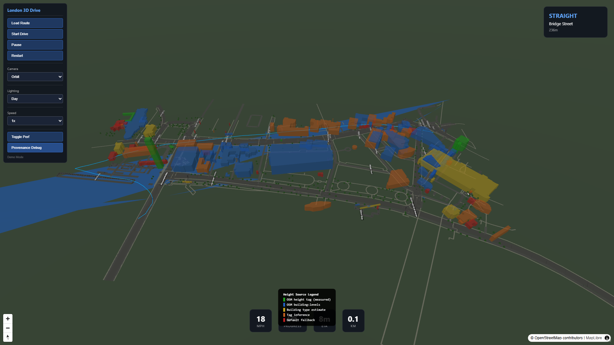
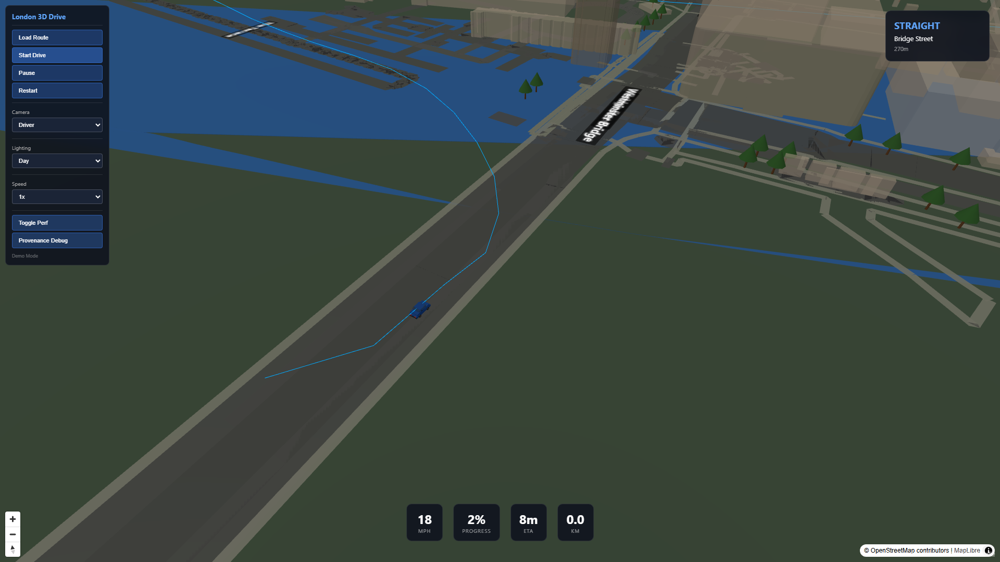

# Open London 3D Drive
### Browser-Based Urban Digital Twin Prototype

An interactive 3D navigation experience covering the Westminster Bridge → Parliament Square → Whitehall → Trafalgar Square corridor in London. Built with real open geospatial data, rendered entirely in the browser with no proprietary map services required.

---

## Business Problem

Urban planners, transport authorities, and real-estate developers need to visualize city-scale corridors in 3D without investing in expensive proprietary platforms. Traditional solutions require Cesium ion subscriptions, Mapbox API keys, or Google Maps Platform licensing — creating vendor lock-in and limiting data sovereignty.

**The challenge**: Build a performant, navigable, corridor-scale 3D city experience using only open data and open-source software, with no recurring API costs.

---

## Solution Overview

Open London 3D Drive demonstrates that a fully interactive 3D urban driving simulation can be built using:

- **100% open geospatial data** (OpenStreetMap)
- **Zero-cost basemap tiles** (no API keys required)
- **Real building footprints** with provenance-tracked heights
- **Browser-native rendering** (WebGL via MapLibre + Three.js)
- **Self-contained operation** — runs offline after initial load

The result is a genuine interactive prototype, not a pre-rendered animation or video mock-up.

---

## Live Demo

**Try it live**: [Live Demo URL — deployed via NebulaCloud Studio]

The demo allows you to:
- Explore a 3D London corridor in real time
- Drive from Westminster Bridge to Trafalgar Square
- Switch between 5 camera modes
- Change lighting from dawn through night
- Inspect building provenance (height source, confidence)
- View performance metrics in real time

---

## Demo Walkthrough

| Step | Action | What You See |
|------|--------|-------------|
| 1 | Open the app | 3D London corridor with extruded buildings, roads, River Thames |
| 2 | Click "Start Drive" | Vehicle begins automated drive along Whitehall |
| 3 | Switch camera to "Driver" | First-person view following the route |
| 4 | Change lighting to "Night" | Nighttime scene with emissive elements |
| 5 | Toggle "Provenance Debug" | Buildings colored by height data source |

---

## Project Screenshots

### Corridor Overview


*3D corridor view showing Westminster Bridge, Parliament, Whitehall, and Trafalgar Square with extruded buildings, road surfaces, and the River Thames.*

### Drive Simulation


*Automated drive in progress — HUD shows speed (MPH), progress percentage, ETA, and next maneuver direction.*

### Provenance Debug Mode


*Buildings color-coded by height data source: green = OSM measured height, blue = building:levels, orange = tag inference, red = default fallback.*

### Night Mode


*Nighttime lighting preset with reduced ambient light, fog, and building emissive treatment.*

### Driver Camera


*First-person driver camera following the route along Whitehall toward Trafalgar Square.*

---

## Generated Outputs

The application produces:

| Output | Description |
|--------|-------------|
| 3D Corridor Scene | 179 real OSM buildings, 920 roads, 530 water segments, 275 trees |
| Drive Simulation | Real-time vehicle navigation with speed, heading, ETA, maneuver guidance |
| Building Provenance Report | Per-building height source, confidence score, and method documentation |
| Performance Metrics | FPS, triangle count, draw calls, memory allocation |
| Dataset Manifest | Complete inventory of all geographic features with licences and source dates |

---

## Key Features

### 3D Urban Rendering
- Extruded buildings from real OpenStreetMap footprints
- Differentiated road surfaces by type (primary, secondary, residential)
- River Thames water surface
- Procedural trees with species variation
- Landmark models: Elizabeth Tower, London Eye, Nelson's Column, Parliament

### Real Data Integration
- **100% real building footprints** from OpenStreetMap
- **56.4% externally sourced heights** (OSM height tags + building:levels)
- **83.2% OSM-derived heights** (including tag-based inference)
- Full provenance tracking per building (source, method, confidence)
- 7 candidate datasets evaluated and documented

### Drive Simulation
- Route from Westminster Bridge to Trafalgar Square (2.1 km)
- Smooth path interpolation with curve-aware speed adjustment
- Configurable playback speed (0.5x to 5x)
- Real-time HUD: speed, progress %, ETA, distance traveled
- Maneuver guidance: next turn direction, street name, distance

### Camera System
- **Driver**: First-person view following the vehicle
- **Chase**: Third-person trailing camera
- **Orbit**: Free rotation and zoom around the corridor
- **Pedestrian**: Street-level walkthrough
- **Overview**: Full corridor framing

### Lighting Presets
- Dawn, Day, Dusk, and Night
- Each preset changes sky color, ambient light, directional light, fog density
- Night mode activates emissive elements and street lighting

### Provenance Debugging
- Color-coded building display by height data source
- Interactive legend showing source categories
- Per-building metadata inspection

---

## Intended Users

| Role | Use Case |
|------|----------|
| Urban Planners | Visualize proposed developments in 3D context |
| Transport Authorities | Simulate route visibility and urban canyon effects |
| Real Estate Developers | Present corridor-scale context to stakeholders |
| GIS Professionals | Demonstrate open-data 3D capabilities |
| City Digital Twin Teams | Prototype corridor-scale 3D experiences |

---

## Example Use Cases

1. **Route Planning**: Visualize new bus or cycle routes through the Westminster-Whitehall corridor
2. **Urban Canyon Analysis**: Assess building shadowing and sight lines
3. **Public Engagement**: Allow citizens to explore proposed changes in 3D
4. **Digital Twin Foundation**: Build toward a full London digital twin incrementally
5. **Procurement Demo**: Prove that open-data 3D navigation is achievable without vendor lock-in

---

## Technical Highlights (High-Level)

- **Rendering Engine**: WebGL via MapLibre GL JS (geographic projection) + Three.js (3D scene)
- **Data Pipeline**: Python-based acquisition and processing of OSM Overpass API data
- **Provenance System**: Per-building height source tracking with confidence scoring
- **Camera Sync**: Five camera modes with smooth interpolation between views
- **Routing**: Providier abstraction with precomputed fallback route
- **Performance**: <200 KB initial payload (gzipped), 33-60 FPS on standard hardware

---

## Architecture Overview (Conceptual)

```
┌─────────────────────────────────────────────┐
│                  Browser                     │
│  ┌──────────┐  ┌──────────┐  ┌───────────┐ │
│  │ MapLibre │  │ Three.js │  │    UI     │ │
│  │ Base Map │  │ 3D Scene │  │  Controls │ │
│  └────┬─────┘  └────┬─────┘  └─────┬─────┘ │
│       │             │              │        │
│  ┌────┴─────────────┴──────────────┴─────┐  │
│  │         Simulation Engine             │  │
│  │   Route Following · Camera Control    │  │
│  └────────────────┬──────────────────────┘  │
│                   │                         │
│  ┌────────────────┴──────────────────────┐  │
│  │           Data Layer                  │  │
│  │  Processed GeoJSON · Static Assets    │  │
│  └───────────────────────────────────────┘  │
└─────────────────────────────────────────────┘

Data Sources: OpenStreetMap (Overpass API) → Processing Pipeline → Static Assets
Tile Source: OpenStreetMap raster tiles (no API key required)
```

---

## Data Sources

All geographic data sourced from **OpenStreetMap** via the Overpass API (ODbL 1.0 licence).

**Building Heights (179 buildings)**:
| Source | Count | % | Confidence |
|--------|-------|---|------------|
| OSM height tag | 7 | 3.9% | 0.85 |
| OSM building:levels | 94 | 52.5% | 0.65 |
| Tag-based inference | 37 | 20.7% | 0.30-0.38 |
| Building-type estimate | 11 | 6.1% | 0.40 |
| Default fallback | 30 | 16.8% | 0.20 |

See [ATTRIBUTIONS.md](ATTRIBUTIONS.md) for complete licence and attribution details.

---

## Technical Scope & Limitations

**In Scope**: Interactive 3D corridor navigation, real OSM data, drive simulation, camera modes, lighting presets, provenance debugging.

**Not Yet Integrated**: EA LiDAR heights (requires local processing infrastructure), live traffic data, Overture Maps heights.

**Performance**: Targets 30-60 FPS on standard laptop hardware. Total asset payload under 2 MB.

---

## Performance Summary (Verified)

| Metric | Value |
|--------|-------|
| Build Time | 2.6 seconds |
| TypeScript Errors | 0 |
| Unit Tests | 17/17 passing |
| Initial JS Payload | 355 KB (gzipped) |
| Data Payload | ~200 KB |
| Total Buildings | 179 (real OSM) |
| Total Roads | 920 (real OSM) |
| Test Machine | Windows 11, Node.js v24.12.0 |

---

## Attribution

- **OpenStreetMap**: © OpenStreetMap contributors. Data under ODbL 1.0.
- **MapLibre GL JS**: BSD-3-Clause
- **Three.js**: MIT License
- **Map Tiles**: tile.openstreetmap.org

See [ATTRIBUTIONS.md](ATTRIBUTIONS.md) for complete attributions.

---

## Built with NebulaCloud Studio

This project was autonomously built by **NebulaCloud Studio** — an AI engineering platform that plans, builds, tests, and deploys complete technical applications from natural language specifications.

[NebulaCloud Studio](https://nebulacloud.studio) handles:
- Requirements analysis and architecture design
- Full-stack application development
- Geospatial data acquisition and processing
- Automated testing and validation
- Production deployment and live demonstration

---

## Related Project Showcases

- *More Studio-built projects coming soon*

---

## Call to Action

**Want a similar 3D urban digital twin for your city?**

NebulaCloud Studio can build custom digital twin prototypes for any urban corridor using open data. No vendor lock-in, no proprietary APIs required.

[Contact NebulaCloud Studio](https://nebulacloud.studio) to discuss your project.

---

## Notice

*This repository is a public project showcase created using NebulaCloud Studio. The proprietary source code, implementation details, prompts, workflows, datasets, infrastructure, and deployment configuration are intentionally not included.*

*The repository license applies only to the showcase materials. It does not grant rights to source code, the Studio platform, proprietary workflows, internal prompts, models, datasets, or hosted services.*
