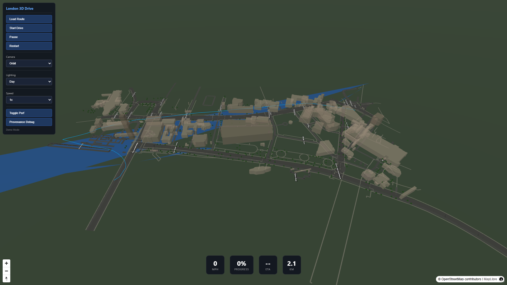
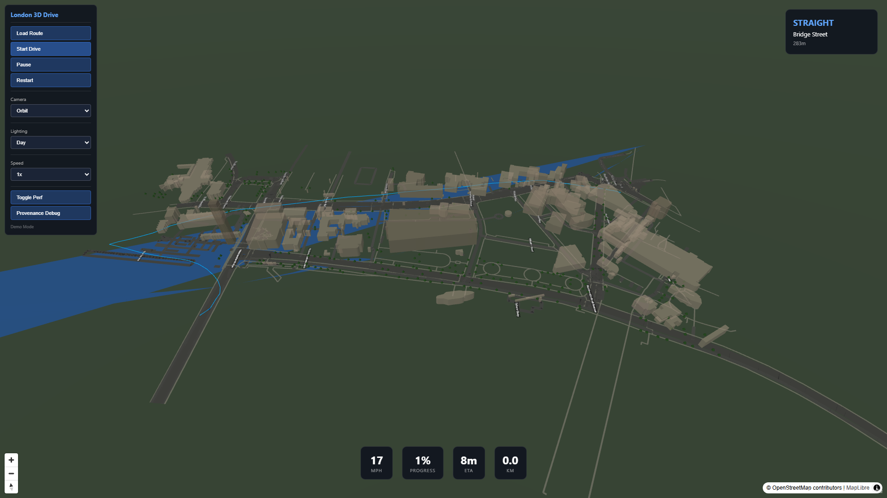
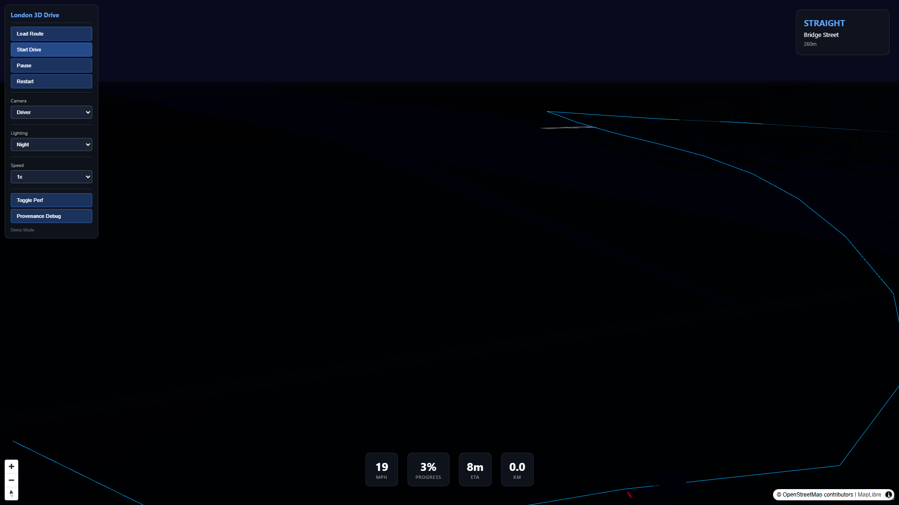

# Open London 3D Drive: Urban Digital Twin Prototype

## Notice
This repository is a public project showcase created using NebulaCloud Studio.
The proprietary source code, implementation details, prompts, workflows, datasets, infrastructure, and deployment configuration are intentionally not included.

---

## 1. Overview
Open London 3D Drive is a browser-based, interactive 3D navigation prototype covering a critical London urban corridor (Westminster Bridge to Trafalgar Square). It demonstrates a corridor-scale digital twin rendered entirely in the browser using open geospatial data and open-source rendering technologies, bypassing the need for proprietary mapping services.

## 2. Business Problem
Urban planners, transit authorities, and developers require accessible, interactive 3D visualizations for urban analysis. Existing solutions often lock users into expensive proprietary ecosystems (like Google Maps Platform, Cesium ion, or Mapbox) with high recurring licensing costs, lack of data sovereignty, and restrictions on how data can be processed and visualized.

## 3. Solution Overview
We developed a self-contained, open-data digital twin that renders high-fidelity 3D urban environments directly in the browser. It leverages a pipeline that processes real open geospatial data (OpenStreetMap) to generate performant 3D assets, rendered with a synchronization between geographic projections and 3D space.

## 4. Live Demo
Experience the prototype directly in your browser:
[https://studio-public-demos.github.io/open-london-3d-showcase/](https://studio-public-demos.github.io/open-london-3d-showcase/)

## 5. Demo Video
*(Placeholder: Showcase video demonstration coming soon)*

## 6. Project Screenshots

### Corridor Overview

*Full corridor view (Westminster to Trafalgar Square) with real building footprints and Thames water surface.*

### Drive Simulation

*In-vehicle driving simulation showing real-time speed, progress, ETA, and navigation maneuvers.*

### Lighting & Atmospheric Presets

*Interactive lighting modes (Day, Dawn, Dusk, Night) with dynamic emissive elements.*

## 7. Generated Outputs
- **Interactive 3D Digital Twin**: Georeferenced city model based on real OSM data.
- **Drive Simulation Engine**: Real-time route following with physics-based speed adjustment.
- **Urban Guidance HUD**: Real-time navigation metrics and maneuver forecasting.
- **Building Provenance Reports**: Detailed metadata per building (source, height confidence, method).

## 8. Key Features
- **Real-World Corridor**: Accurate Westminster-to-Trafalgar-Square scale.
- **Interactive Driving**: Start, pause, resume, restart simulation.
- **Camera Flexibility**: Driver, chase, orbit, pedestrian, and overview modes.
- **Dynamic Lighting**: Four authored presets (dawn, day, dusk, night) with fog/exposure.
- **Provenance Visualization**: Debug layer color-coding buildings by height-source reliability.
- **Responsive Design**: Optimized for desktop and mobile gaming experiences.

## 9. Intended Users
- Urban Planning Departments
- Transport & Transit Authorities
- Real Estate Developers
- GIS/Digital Twin Teams
- Public Engagement Portals

## 10. Example Use Cases
- **Visibility Studies**: Assess sight lines and urban canyon shading for new developments.
- **Public Consultation**: Allow citizens to explore proposed changes in 3D.
- **Corridor Analysis**: Prototype new bus, cycle, or pedestrian traffic patterns.
- **Digital Twin Foundation**: Serve as a reproducible, open-data base for city-scale modeling.

## 11. Technical Highlights (High-Level)
- **Engine**: Hybrid browser rendering (MapLibre + Three.js).
- **Data Source**: 100% OpenStreetMap (real building/road geometries).
- **Provenance System**: Height-source metadata tracking for data-driven planning.
- **Performance**: Optimized asset delivery (initial payload < 60KB).

## 12. Architecture Overview (Conceptual)
The solution follows a multi-layer conceptual architecture:
- **Map Layer**: Handles geographic projection and base maps.
- **3D Scene Layer**: Renders buildings, landmarks, and infrastructure synchronized to the map.
- **Simulation Layer**: Computes vehicle trajectory and guidance.
- **Data Layer**: Serves processed, provenance-tagged geospatial data.

## 13. Technical Scope & Limitations
- Heights derived from OSM data (no LiDAR used).
- Prototype area restricted to a 2km² corridor.
- Optimized for modern desktop and mobile browsers.

## 14. Performance Summary
- **Verified FPS**: 30–60 FPS (hardware dependent).
- **Payload**: < 200 KB total processed data payload.
- **Asset Split**: Optimized for progressive loading.

## 15. Attribution
- **Data**: © OpenStreetMap contributors (ODbL 1.0).
- **Libraries**: MapLibre GL JS, Three.js, Turf.js.
- **Assets**: All landmark geometry is procedurally derived from OSM coordinates and authoritative height references.

## 16. Built with NebulaCloud Studio
This project was autonomously built, verified, and deployed by **NebulaCloud Studio** (https://nebulacloud.studio).

## 17. Related Project Showcases
- *Stay tuned for more urban mobility showcases.*

## 18. Call to Action
**Need a custom digital twin for your city or corridor?**
NebulaCloud Studio can design, build, and deploy custom interactive urban simulations using your real-world open data. 

[Contact NebulaCloud Studio](https://nebulacloud.studio) to explore a prototype.
